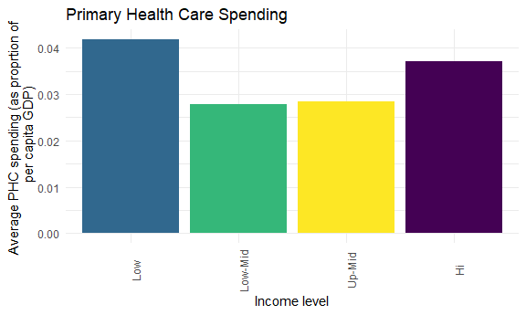

P8105 Final Project
================

``` r
library(tidyverse)
```

    ## -- Attaching packages --------------------------------------- tidyverse 1.3.1 --

    ## v ggplot2 3.3.5     v purrr   0.3.4
    ## v tibble  3.1.4     v dplyr   1.0.7
    ## v tidyr   1.1.3     v stringr 1.4.0
    ## v readr   2.0.1     v forcats 0.5.1

    ## -- Conflicts ------------------------------------------ tidyverse_conflicts() --
    ## x dplyr::filter() masks stats::filter()
    ## x dplyr::lag()    masks stats::lag()

``` r
library(readxl)

knitr::opts_chunk$set(
  fig.width = 6,
  fig.asp = .6,
  out.width = "90%"
)
theme_set(theme_minimal() + theme(legend.position = "bottom"))

options(
  ggplot2.continuous.colour = "viridis",
  ggplot2.continuous.fill = "viridis"
)

scale_coulour_discrete = scale_color_viridis_d
scale_fill_discrete = scale_fill_viridis_d
```

## Data import

``` r
ghed_df <- read_excel("data/GHED_data.xlsx")
```

### Safiya’s section

**Indicators** Primary health care - phc\_usd\_pc  
Infectious disease - dis1\_usd2018  
Noncommunicable disease - dis4\_usd2018  
Preventive care - hc6\_usd2018  
Curative care - hc1\_usd2018  
GDP - gdp\_pc\_usd  
CHE - che\_pc\_usd

**Primary Health Care Spending**

Primary health care spending by income level (USD per capita)

``` r
PHC_df <-
  ghed_df %>% 
    janitor::clean_names() %>% 
    filter(year == 2018) %>% 
    drop_na(phc_usd_pc) %>% 
    group_by(income_group_2018) %>% 
    summarize(
      n_countries = n(),
      avg_phc = mean(phc_usd_pc))

PHC_df %>% 
  ggplot(aes(x = fct_relevel(as.factor(income_group_2018), c("Low", "Low-Mid", "Up-Mid", "Hi")), y = avg_phc,  fill = income_group_2018)) +
  geom_col() +
  labs(
    title = "Primary Health Care Spending",
    x = "Income level",
    y = "Average PHC spending (per capita USD)"
  ) + 
  theme(axis.text.x = element_text(angle = 90)) +
  theme(legend.position = "none")
```


Primary health care spending by income level (as as proportion of per
capita GDP)

``` r
PHC_df <-
  ghed_df %>% 
    janitor::clean_names() %>% 
    filter(year == 2018) %>% 
    drop_na(phc_usd_pc, gdp_pc_usd) %>% 
    group_by(income_group_2018) %>% 
    summarize(
      n_countries = n(),
      avg_phc = mean(phc_usd_pc / gdp_pc_usd))

PHC_df %>% 
  ggplot(aes(x = fct_relevel(as.factor(income_group_2018), c("Low", "Low-Mid", "Up-Mid", "Hi")), y = avg_phc,  fill = income_group_2018)) +
  geom_col() +
  labs(
    title = "Primary Health Care Spending",
    x = "Income level",
    y = "Average PHC spending (as proprtion of \n per capita GDP)"
  ) + 
  theme(axis.text.x = element_text(angle = 90)) +
  theme(legend.position = "none")
```



Primary health care spending by income level (as a proportion of per
capita health expenditure)

``` r
PHC_df <-
  ghed_df %>% 
    janitor::clean_names() %>% 
    filter(year == 2018) %>% 
    drop_na(phc_usd_pc, gdp_pc_usd) %>% 
    group_by(income_group_2018) %>% 
    summarize(
      n_countries = n(),
      avg_phc = mean(phc_usd_pc / che_pc_usd))

PHC_df %>% 
  ggplot(aes(x = fct_relevel(as.factor(income_group_2018), c("Low", "Low-Mid", "Up-Mid", "Hi")), y = avg_phc,  fill = income_group_2018)) +
  geom_col() +
  labs(
    title = "Primary Health Care Spending",
    x = "Income level",
    y = "Average PHC spending (as proportion of \n per capita health expenditure)"
  ) + 
  theme(axis.text.x = element_text(angle = 90)) +
  theme(legend.position = "none")
```


**Preventive vs. Curative Spending**

### Other sections
